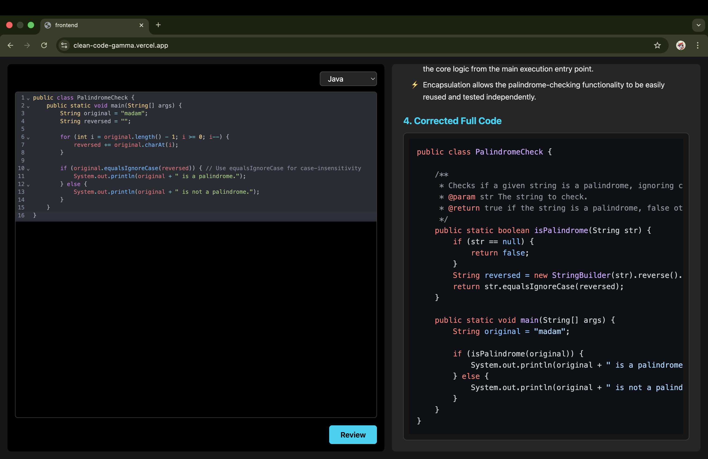

# 🧠 CleanCode – AI Powered Code Reviewer

CleanCode is a modern, intelligent, multi-language **AI code reviewer** that analyzes your code, detects bugs, suggests fixes, explains improvements, and generates the fully corrected version — all in one clean UI.

Built using **React, CodeMirror, TailwindCSS, Node.js, and Google Gemini 2.5 Pro**, this project brings VS Code–like reviewing power directly into the browser.

---
## 🛠️ Tech Stack


---

## 🚀 Features Overview

| Feature | Description |
|--------|-------------|
| **AI Code Review** | Uses Google Gemini 2.5 Pro to analyze code and generate structured 4-section reviews. |
| **Error Detection** | Identifies bugs, vulnerabilities, logic issues, edge-case flaws, and bad practices. |
| **Recommended Fixes** | Provides actionable, developer-friendly corrections for each error. |
| **Impact of Fixes** | Explains performance, security, and maintainability improvements. |
| **Corrected Full Code** | Generates a complete improved version of your code with one-click copy. |
| **Auto Language Detection** | Automatically detects Java, Python, C, C++, JavaScript, TypeScript, and Go. |
| **CodeMirror 6 Editor** | Features syntax highlighting, auto-indentation, scroll support, and dark mode. |
| **Responsive UI** | Clean, modern two-panel layout styled with TailwindCSS. |
| **Markdown Rendering** | AI output rendered with headings, bullet points, icons, and code blocks. |
| **Syntax Highlighting** | Uses highlight.js to highlight all code inside the review panel. |
| **Toast Notifications** | Success, error, and loading toasts for better user experience. |
| **Error Handling** | Backend/API errors gracefully handled with fallback messages. |
| **Scrollable Panels** | Both editor and review sections support vertical scrolling. |
| **Loading Animation** | Displays smart "Reviewing your code…" animation during AI processing. |

---
## 🧱 Project Architecture

```
clean-code/
│
├── backend/
│   ├── src/
│   │   ├── controllers/
│   │   ├── routes/
│   │   ├── services/
│   │   └── app.js
│   ├── server.js
│   └── .env   (NOT committed – secure)
│
└── frontend/
    ├── src/
    │   ├── App.jsx
    │   ├── utils/
    │   └── main.jsx
    ├── index.html
    └── vite.config.js
```

---
## 🔗 Live URLs

| Service                  | URL                                                                          |
| ------------------------ | ---------------------------------------------------------------------------- |
| 🌐 **Frontend (Vercel)** | [https://clean-code-gamma.vercel.app](https://clean-code-gamma.vercel.app)   |
| 🔧 **Backend (Render)**  | [https://clean-code-lv31.onrender.com](https://clean-code-lv31.onrender.com) |

---
## 🖼️ Screenshots

| Code Editor                                | AI Review Output                             | Corrected Code                                  |
| -------------------------------------------| ---------------------------------------------|-------------------------------------------------| 
|  |  |  |

---
<h2 align="left">🔗 Live Demo</h2>

<p align="left">
  <a href="https://clean-code-gamma.vercel.app/" target="_blank">
    
  </a>
</p>

---
🔧 Backend Setup
```
cd backend
npm install
```
1. Create .env file:

```
GOOGLE_GEMINI_KEY=your_key_here
PORT=3000
```
2. Start the Server

```
npm start
```
---
🎨 Frontend Setup

```
cd frontend
npm install
npm run dev
```
---

## 🌟 Future Enhancements

- VS Code theme support  
- Side-by-side diff viewer  
- Multi-file project review  
- GitHub PR review integration  
- Code quality scoring  
- Saved review history  
- Light/Dark theme toggle  

---

## 🤝 Contributing
Pull requests and suggestions are always welcome.

---

## ⭐ Support the Project
If you like CleanCode, please **star the repository** — it helps others discover the project!
